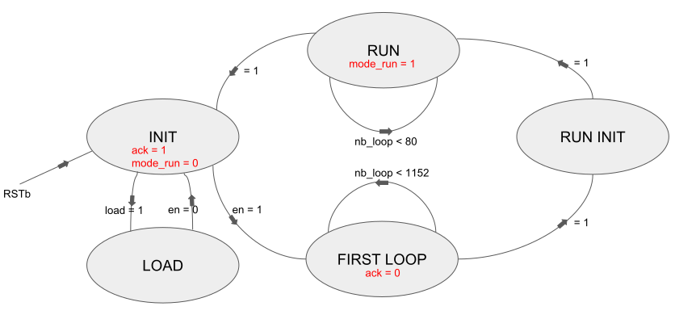

# IP Chiffrement

L'IP Chiffrement est un bloc VHDL avec 6 entrées et 2 sorties comme représenté ci-dessous:

Cette IP permet de prendre en entrée un flux de donnée de 80bits et d'obtenir en sortie un paquet de 80bits chiffrés.
Dans l'IP on retrouve deux autres IPs :
- Le 'TRIVIUM'
- Le 'BUFFER' 

## IP Trivium

Le Trivium Permet de chiffrer un flux de donnée
Spécifications:
- > 32bits/cycle à un frequence de 10MHz

Nous avons implémenté 6 entrées et 3 sorties :
- L'entrée 'CLK' permet d'être synchronisée sur l'horloge
- L'entrée 'RSTb' permet de reseter la machine à état de l'IP
- L'entrée 'EN' permet de sortir de l'etat initial de la FSM et donc de commencer le chiffrement
- L'entrée 'LOAD' permet de charger la clé secrete
- L'entrée 'IV_IN' correspond à l'entrée du flux de donnée (bus sur 80bits)
- L'entrée 'SK_IN' correspond à l'entrée de la clé secrete (bus sur 80bits)
- La sortie 'ACK' est un flag qui avertit lorsque la FSM est dans l'état *INIT*
- La sortie 'MODE_RUN' est un flag qui avertit lorsque la FSM est dans l'état *RUN*
- La sortie 'KEY_STREAM_OUT nous permet d'obtenir bit à bit la donée chffrée

## IP Buffer_80bits

____________________________
*Référence vers depot github :*

- [IP Trivium Regis](https://github.com/inmcm/HDL_Ciphers/blob/master/Trivium)
- [IP Trivium Tiers](https://github.com/yahniukov/Trivium_FPGA)
